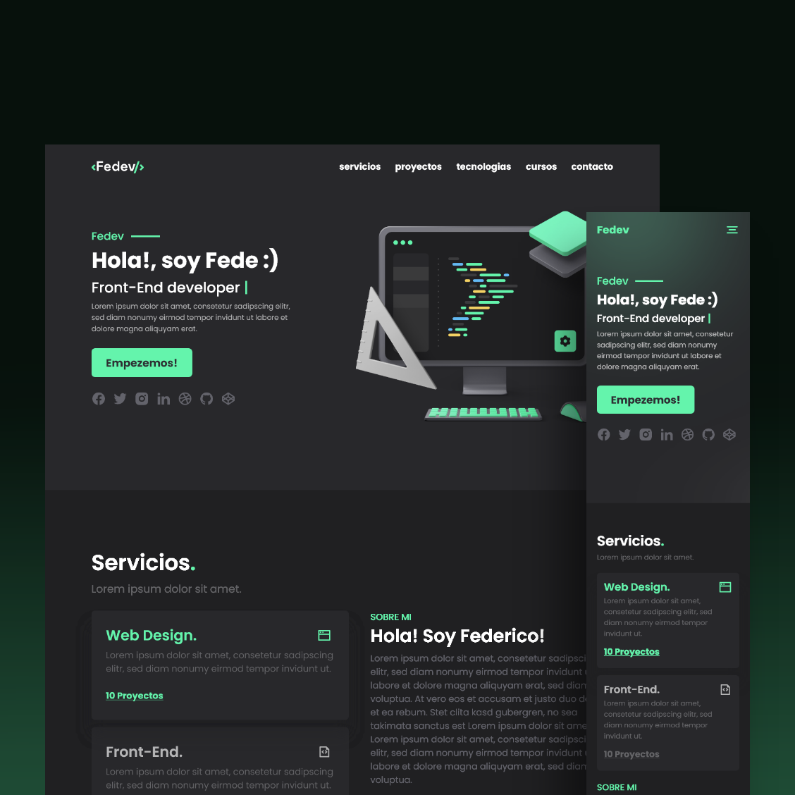

<!-- FEDEVCODE LOGO -->
 

  

  <h3 align="center">Fedevcode Portfolio</h3>
  

    <a href="https://fedevcode.com">Ir a la Web</a>
  

<!-- PORTFOLIO PREVIEW -->
## Previsualización

    

<!-- CREATED WITH -->
### Creada con:

* HTML
* CSS (SASS)
* BEM
* JAVASCRIPT
* RELLAX.JS

<a href="#top">Volver arriba</a>

<!-- CONTACT -->
## Contacto

* Fedevcode - [Todas mis redes](https://linktr.ee/fedevcode)  
* Email - info@fedevcode.com

<a href="#top">Volver arriba</a>

<!-- OTHER PROJECTS -->
## Otros proyectos

* Mubiplex Concepto - [Mubiplex](http://mubiplex.fedevcode.com/)  
* Mubiplex Repo - [Repo](https://github.com/fedevcode/Mubiplex-Concept)   
* CV Web - [CV WEB](http://cv.fedevcode.com/)  
* CV Repo - [CV Repo](https://github.com/fedevcode/CV-Fedevcode)  
* CV PDF - [CV PDF](https://linktr.ee/fedevcode)  

<a href="#top">Volver arriba</a>

<!-- GRATITUDE -->
## Agradecimientos

* Mariano Weinzettel - Freelance UI Designer <a href="https://www.behance.net/mweinz">Behance</a> - <a href="https://www.instagram.com/marianoweinz/" target="_blank">Instagram</a> - <a href="https://ar.linkedin.com/in/mweinz" target="_blank">Linkedin</a>  
* Romina Peralta - UX Desinger Trainee <a href="https://www.behance.net/rominaperaltaux" target="_blank">Behance</a> - <a href="https://ar.linkedin.com/in/rominaperaltaux" target="_blank">Linkedin</a>  

<a href="#top">Volver arriba</a>

